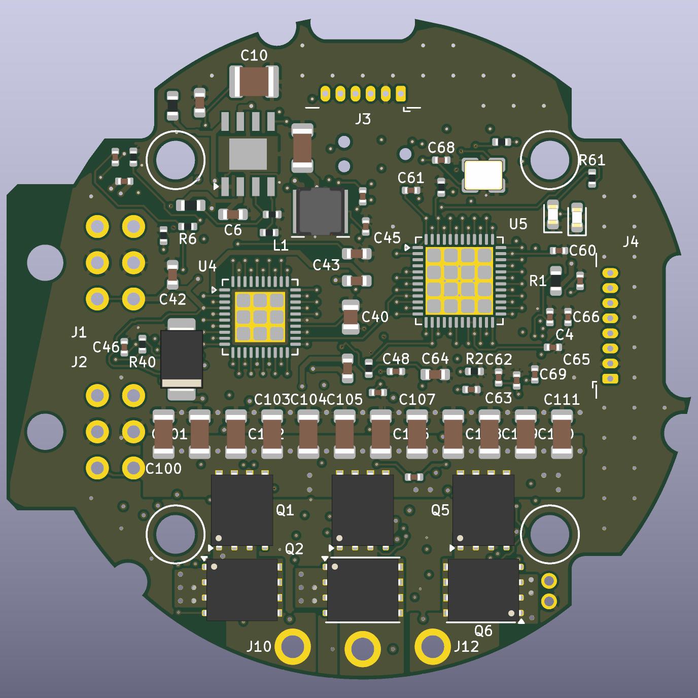

# bldc-controller-60v

A 48 V nominal / 60 V max BLDC motor controller that fits wherever a MAB Robotics MD80 v3.0
fits: same outline, mounting holes, Micro-Fit and AUX connectors, phase-wire holes and
encoder position, with the MD80's 20 A continuous / 80 A peak phase current.



## Status

| Item | State |
|---|---|
| Schematic (KiCad 10, 6 sheets, 137 symbols) | done, ERC 0 errors 0 warnings |
| PCB outline, holes, connectors vs MAB STEP | done, 36 holes match to 0.000 mm (`mech/fit_check.txt`) |
| PCB rev B (144 footprints, 6 layers) | routed; DRC: 0 unconnected, 1 error (MD80-inherent AUX1/screw overlap); two-shunt power stage, 5.0SMDJ60A TVS |
| Simulation | loop inductance, double pulse, bus surge, current loop: docs/simulation.md |
| Firmware | not started; pin map and bring-up values in docs/firmware.md |
| Bench validation | none; loss figures are estimates |

## Layout

```
hardware/            KiCad 10 project (open better-md80.kicad_pro)
  lib/               project symbol (DRV8353S) and MD80 footprints
  better-md80.kicad_dru   60 V clearance rules
docs/
  architecture.md    spec, what limits the MD80 to 48 V, part selection, power tree
  mechanical.md      MD80 fit data and what to verify before first power-up
  thermal_layout.md  loss budget, stack-up, layout rules
  firmware.md        pin map, clocks, DRV8353 settings, protection thresholds
  simulation.md      FastHenry / LTspice / MATLAB results and the changes they call for
  bom.csv            grouped BOM with MPNs
  schematic.pdf      all sheets
mech/                geometry extracted from MAB's MD80_V3.0_simplified.step
sim/                 simulation scripts (outputs in sim/out)
tools/               generators (design.py is the source of truth for the schematic)
```

## Regenerating

```bash
bash tools/build.sh
```

This rebuilds footprints, schematic, netlist, ERC/DRC reports, BOM, the schematic PDF and
the 3D renders. It leaves the routed PCB alone unless you run it with `REGEN_PCB=1`, which
regenerates the placement and throws the routing away (see tools/route.md to redo it).
Schematic changes reach the board through KiCad's Update PCB from Schematic as usual.

`tools/analyze_step.py` needs Python with CadQuery; everything else uses KiCad 10's
`kicad-cli` and bundled Python.

The KiCad files keep their original `better-md80` working name.
