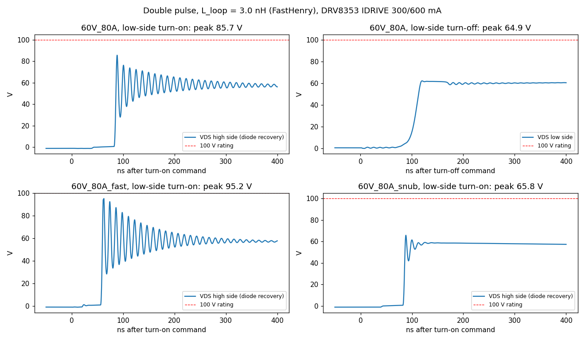
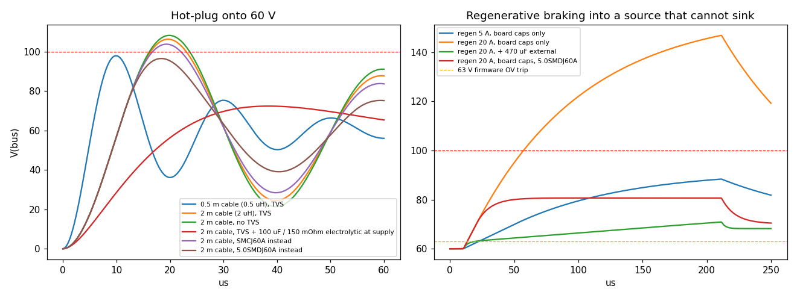
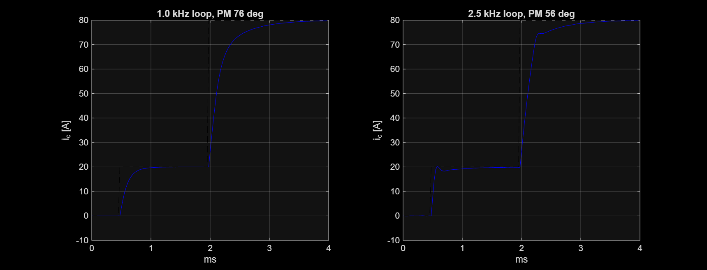

# Simulation report

## Layout rev B (current board)

Changes driven by the rev A results below: D1 is now a 5.0SMDJ60A (SMC), the power stage
uses two top-side shunts (phases A and C) standing between the high-side FETs, and phase
B's low side returns straight into the GND plane.

| Check | Rev A | Rev B |
|---|---|---|
| Commutation loop, phase A/C (FastHenry, `loop_inductance.py --rev-b`) | 5.0 nH | **2.96 nH** |
| Commutation loop, phase B | 5.0 nH | **2.70 nH** |
| Hot-plug 60 V through 2 m cable | 106 V (SMBJ60A) | **96 V (5.0SMDJ60A)** |
| Double pulse 60 V / 80 A, diode-recovery peak (IDRIVE 300 mA) | 83 V | 86 V |
| Double pulse 60 V / 20 A | 76 V | 71 V |
| Double pulse 60 V / 80 A with snubbers fitted | 60 V | 66 V |

The shorter loop raises the ringing frequency (about 70 -> 95 MHz) but does not lower the 80 A
peak, which is set by the body-diode recovery of the ISC022N10NM6 at this gate drive. The
100 V FETs keep about 14 V of margin at the worst case; keep IDRIVEP at 300 mA and fit the
snubbers on the first boards.

Remaining layout weaknesses in rev B: crystal traces 18 / 26 mm (the MCU surroundings are full
of fan-out vias), gate traces 24-31 mm, and 52 reference designators hidden for lack of room.

# Rev A results (first layout pass)

Tools on the design laptop: FastHenry2 (loop inductance), LTspice 26 (switching and bus
transients), MATLAB R2026a + Control System Toolbox (current loop). Every run is a script
in `sim/`; plots and numbers land in `sim/out/`.

| Script | What it answers |
|---|---|
| `sim/loop_inductance.py` | Commutation-loop inductance of a half-bridge from the routed copper |
| `sim/double_pulse.py` | Switch-node overshoot and ringing at 48/60 V, 20/80 A |
| `sim/bus_surge.py` | Hot-plug overshoot and regenerative pump-up of the DC bus |
| `sim/foc_current_loop.m` | Current-loop margins, bandwidth and noise with the real sensing chain |

## 1. Commutation loop inductance (FastHenry2)

Phase B loop, following the routed copper: DC-link capacitor, VBUS pour, high-side FET,
phase pour, low-side FET, low-side pour and its 5 vias, Kelvin shunt on B.Cu, 3 ground
vias, meshed In1 GND plane back to the capacitor. MOSFET packages are modelled as 0.6 mm
straps.

| Case | L at 10-100 MHz |
|---|---|
| As routed (5 LS vias, 3 shunt GND vias) | **5.0 nH** |
| 10 LS vias, 8 shunt GND vias | 4.9 nH |
| High-frequency loop through the local 100 nF (C26) | 5.1 nH |

More vias barely help: the loop area is set by the MD80 geometry (DC-link row at
y = -7 mm, low-side FETs and shunts at y = -20 mm, shunts on the bottom side). 5 nH is
workable at 60 V with the drive strength below, but it is the number to attack in a
layout revision: moving the shunts to the top side next to the low-side sources, or
adding 100 nF 100 V 0402s directly across each half-bridge, would roughly halve it.

## 2. Double-pulse test (LTspice)

ISC022N10NM6 VDMOS model fitted to the Infineon datasheet Rev 2.1 (Ciss 5400 pF,
Coss 1200 pF and Crss 19 pF at 50 V, Qg 73 nC, Qgd 11.9 nC, Qoss 135 nC, Qrr 70 nC,
RG 1.4 Ohm), 5.0 nH loop, 15 nH routed gate trace, DRV8353 IDRIVE as set in firmware.

| Case | Low-side turn-off peak | High-side peak at low-side turn-on (diode recovery) |
|---|---|---|
| 60 V, 80 A, IDRIVE 300/600 mA | 64.8 V | **83.2 V** |
| 60 V, 20 A | 62.5 V | 75.6 V |
| 48 V, 80 A | 52.8 V | 77.1 V |
| 60 V, 80 A, IDRIVE 700/1400 mA | 64.9 V | **95.1 V** |
| 60 V, 80 A, RC snubber 2.2 Ohm + 2.2 nF fitted | 64.8 V | 60.3 V |

The critical event is not turn-off but the body-diode recovery of the opposite FET.
With IDRIVE capped at 300 mA source the worst case keeps 17 V of margin on the 100 V
parts; faster drive leaves under 5 V. Recommendation: keep IDRIVEP at or below 300 mA
in firmware, and fit the DNP snubbers (R30-R32, C23/C27/C31) on the first boards until
the ringing is measured. Ringing is 60-80 MHz; snubber loss at 40 kHz is about
0.5 x 2.2 nF x 60^2 x 2 x 40 kHz = 0.32 W per phase in the 0805 resistor, which is at its limit, so
use a 1206 or 2x 0805 if the snubbers stay.

## 3. DC-bus transients (LTspice)

Bus: 24x 2.2 uF 100 V X7S, about 20 uF left at 60 V bias.

| Case | Peak bus voltage |
|---|---|
| Hot-plug onto 60 V, 0.5 m cable, SMBJ60A | 97.9 V |
| Hot-plug onto 60 V, 2 m cable, SMBJ60A | **106.2 V (exceeds 100 V parts)** |
| same, no TVS | 108.2 V |
| same, SMCJ60A | 103.7 V |
| same, **5.0SMDJ60A** (SMC package) | **96.4 V** |
| same, SMBJ60A + 100 uF electrolytic at the supply | 72.3 V |
| Regen 5 A into a supply that cannot sink, board caps only | 88 V (reaches 63 V in 12 us) |
| Regen 20 A, board caps only | 147 V (TVS overwhelmed) |
| Regen 20 A, + 470 uF external | 71 V |
| Regen 20 A, board caps, 5.0SMDJ60A | 81 V |

Findings that change the design or its operating rules:

1. **D1 should be a Littelfuse 5.0SMDJ60A** (5 kW, SMC/DO-214AB, 2.3 mm tall, fits the
   MD80 height envelope). The SMBJ60A cannot hold a 60 V hot-plug through a 2 m cable
   below 100 V. This needs the D1 footprint changed from SMB to SMC in the next layout
   pass. Until then, do not hot-plug above 48 V (peak scales with the bus: about 85 V at 48 V).
2. **At 60 V the bus must be able to absorb regenerative energy.** 20 uF of ceramics
   charge 3 V in 12 us at only 5 A of braking current, far faster than a 40 kHz control
   loop can react. Run 60 V systems from a battery, or put at least 470 uF on the bus
   near the actuators (the MAB PDS or an equivalent power board), or add a brake chopper.
   Firmware regen limiting (docs/firmware.md) still matters, but it is not sufficient alone.

## 4. Current loop (MATLAB)

Discrete PI at 40 kHz, 1.5-sample delay, 0.5 mOhm shunt, CSA gain 20, 12-bit ADC
(80.6 mA/LSB, +/-165 A), 50 mA rms analog noise, SVPWM voltage limit at 48 V. Motor
R = 0.20 Ohm, L = 90 uH (assumed 8108-class actuator motor; replace with measured values).

| Target bandwidth | Phase margin | Gain margin | Closed-loop -3 dB | Noise at 20 A |
|---|---|---|---|---|
| 1.0 kHz | 76.5 deg | 16.5 dB | 1.36 kHz | 7 mA rms |
| 2.5 kHz (MD80 maximum) | 56.3 deg | 8.5 dB | 5.97 kHz | 52 mA rms |

The sensing chain supports the MD80's full 2.5 kHz torque bandwidth with healthy margin.
Three-shunt sampling at the PWM valley needs about 1 us of CSA settling, which caps the
modulation at 92 % duty; above that, reconstruct the third phase from the other two.

## 5. Signal integrity (by calculation, not field-solved)

| Net | Routed length | Assessment |
|---|---|---|
| CANH / CANL | 54 / 37 mm | CAN-FD at 8 Mbit/s has ~15-25 ns edges; the on-board stub is far below the ~1.5 m critical length. Fine. |
| SPI3 (encoder + AUX1) | 30-34 mm, 2-3 vias | Fine at the AS5047P's 10 MHz. |
| **HSE crystal** | **16 / 33 mm, 2-3 vias** | **Too long.** The packer placed Y1 away from the MCU. Move Y1 and C68/C69 within 3 mm of PF0/PF1 in the next pass; otherwise expect oscillator start-up margin problems. |
| Gate drive GHx/GLx | 21-27 mm, 2 vias | Longer than ideal (target under 15 mm); included in the double-pulse model as 15 nH. |

## 6. Copper loss in the power path (by calculation)

Sheet resistance: 2 oz outer 0.25 mOhm/sq, 1 oz inner 0.49 mOhm/sq.

| Path | Estimate | Loss at 20 A RMS | at 80 A peak |
|---|---|---|---|
| Phase pour FET to wire hole (F.Cu + In4), per phase | 0.25 mOhm | 0.10 W | 1.6 W (2 s) |
| VBUS from Micro-Fit to the bridge (In4 plane + pours) | 0.7 mOhm | 0.07 W at 10 A input | |

Negligible next to the ~9 W semiconductor loss in docs/thermal_layout.md.

## Changes these results call for

| # | Change | Why |
|---|---|---|
| 1 | D1 SMBJ60A -> 5.0SMDJ60A (SMC footprint) | Hot-plug at 60 V exceeds 100 V otherwise |
| 2 | Firmware IDRIVEP <= 300 mA | Diode-recovery overshoot 95 V at 700 mA |
| 3 | Fit snubbers on first boards, 1206 resistor | Ringing damping until measured |
| 4 | Move Y1 next to the MCU | 16-33 mm crystal traces |
| 5 | Operating rule: 60 V only with a battery or >= 470 uF bus capacitance | Regen pump-up |
| 6 | Next layout: shunts to top side / extra local HF caps | Cut the 5 nH loop roughly in half |
